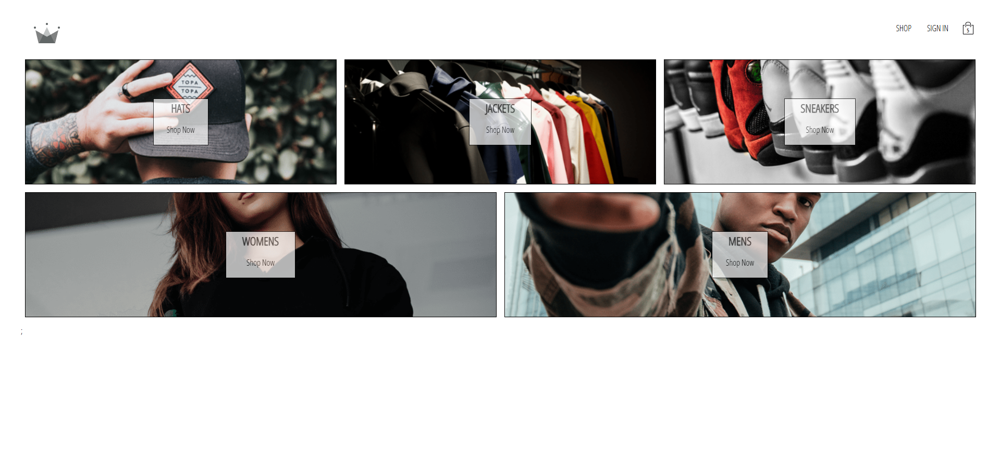

# 🛍️ Clothing Shop

An elegant and fully responsive eCommerce web app for a fictional clothing store, built with React and Stripe. This
project demonstrates a modern online shopping experience including product browsing, cart management, and secure payment
integration.

---

## 🚀 Features

- 🛒 Add/remove products from cart
- 📦 Stripe checkout integration (test mode)
- 💳 Secure payment handling via serverless Netlify functions
- 🔄 State management using Redux-Saga
- ⚡ Hosted on Netlify

## 📦 Planed Features:

- An order form will be implemented where customers can enter their shipment details, such as name, address, and contact
  information. This data will be stored in Firestore for order management and tracking purposes.
- The design of the application will be fully responsive, with a focus on providing a seamless user experience on mobile
  devices. This includes adjusting the layout, buttons, and text to fit smaller screens.
- The application will handle the payment status by checking if the payment was successful or failed after the user
  completes the checkout process.

---

## 🧑‍💻 Tech Stack

- **Frontend:** React, JavaScript, Redux-Saga, Syled Components
- **Payments:** Stripe API
- **Backend (Serverless):** Netlify Functions
- **Deployment:** Netlify

---

## 💳 Test Stripe Payment (Sandbox)

You can test the checkout with the following Stripe test card:

- Card Number: 4242 4242 4242 4242
- Expiry Date: Any future date (e.g., 12/25)
- CVC: 123
- Postal Code: Any valid postal code (e.g., 94103)